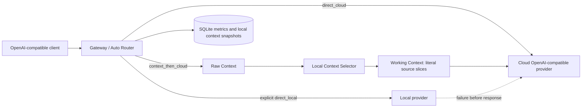

# Edge-Cloud Gateway

[](https://github.com/liufei141748-bfm/edge-cloud-gateway/actions/workflows/ci.yml)
**Experimental V1 · v0.1.0 · not production-ready**

A quality-first, token-efficient, OpenAI-compatible edge-cloud LLM gateway that automatically routes requests and safely reduces unnecessary cloud input tokens through local context selection.

中文：一个质量优先、兼容 OpenAI API 的端云混合 LLM 网关，通过自动路由和安全的本地上下文筛选，减少不必要的云端输入 Token。普通客户端无需识别输入类型，Gateway 会保守选择 `direct_cloud`、`context_then_cloud`，或在明确请求时使用 `direct_local`。

The default configuration is fully offline mock mode. It does not contact a model endpoint. Mock and dry-run results validate protocol and routing behavior only; they do not prove model quality, latency, cost savings, or production readiness.

默认配置为完全离线的 mock 模式，不访问任何模型服务。Mock 与 dry-run 只能验证协议和路由流程，不能证明真实模型质量、延迟、费用节省或生产可用性。

## Status / 项目状态

Experimental V1 is intended for local evaluation and research. The project exposes Chat Completions-compatible endpoints, retains conservative fallback behavior, records local metrics, and ships with an offline regression suite. It has not completed production hardening, multi-tenant isolation, broad provider certification, or real-workload quality validation.

Experimental V1 面向本地研究与验证。项目已具备 Chat Completions 兼容接口、保守回退、本地指标和离线回归；尚未完成生产加固、多租户隔离、广泛 provider 认证或真实 workload 质量验证。

## Why / 为什么需要它

OpenAI-compatible clients normally send one request to one model. This gateway adds a controlled decision layer without changing the client protocol:

- preserve the full request when optimization is unsafe or unhelpful;
- optionally ask a local model to select relevant original context IDs;
- send the resulting literal Working Context to the configured cloud model;
- expose route, fallback, latency, usage-source, and context-reduction metrics.

普通 OpenAI-compatible 客户端只需把请求发给 Gateway。对于不安全、无法净缩减或本地失败的情况，Gateway 保留完整请求并回退云端；只有满足保护条件时，本地模型才参与原文片段选择。

## Architecture / 架构



The stable routing, context protection, SSE, fallback, and metrics core remains provider-independent. Provider configuration is limited to adapter type, model, base URL, and environment-variable name.

稳定的 routing/context/SSE/fallback/metrics 核心不依赖具体模型品牌。Provider 配置只负责适配器类型、模型、Base URL 与密钥环境变量名。

### Provider-agnostic design / Provider 无关设计

The cloud side uses an OpenAI-compatible adapter. The local side uses either that adapter or the dedicated Ollama adapter. Auto Router, Safety Layer, Context Selector, fallback, SSE, and metrics do not branch on provider brand or model name.

云端统一使用 OpenAI-compatible adapter；本地可选择同一 adapter 或 Ollama 专用 adapter。核心逻辑不根据 provider 品牌或模型名称分支。

### Token Reduction / Token 缩减原理

```text
Raw Context
    ↓
Local Context Selection
    ↓
Working Context
    ↓
Cloud Model
```

The intended reduction is **cloud input token reduction**. It is not a guarantee of lower total tokens or total cost: the local selector consumes tokens, cloud output may change, latency and local compute increase, and many requests intentionally use `direct_cloud` without reduction. Whether reduction is safe and useful depends on the request, local model, selector behavior, Safety Layer, and configured providers/models.

目标是减少安全可删除的云端输入 Token，而不是保证每个请求的总 Token 或总成本下降。本地 Selector 也会消耗 Token，云端输出可能变化，延迟和本地计算成本也可能增加；部分请求会按质量优先原则直接上云。

### Safety Layer and RuleBasedPolicy

`UniversalSafetyLayer` produces non-bypassable protection signals and content-free `RoutingFeatures`. `RuleBasedPolicy` consumes that assessment and returns a `RouteDecision`. A future policy may replace or assist the rule policy, but it must remain downstream of the Safety Layer.

## Routes / 三种路径

| Route | Trigger | Behavior |
| --- | --- | --- |
| `direct_cloud` | default, short request, protected state, disabled local provider, selector failure, or no safe reduction | sends the full rendered request to the configured cloud provider |
| `context_then_cloud` | `model=adaptive` candidate or explicit `gateway_context.optimize=true`, after safety checks | local selector returns IDs; cloud receives selected literal source slices plus protected material |
| `direct_local` | explicit local alias with the supported standalone JSON-schema task shape | validates the local result; failure before delivery falls back once to cloud |

`> min_input_tokens` only makes a request eligible for context evaluation. It never forces compression.

超过 `min_input_tokens` 只代表“进入候选判断”，不代表强制压缩。

## Auto Router

Use `model="adaptive"` with ordinary `messages`. The client does not need `gateway_context`. The router estimates input size, protects opaque or tool-chain state, checks for selectable blocks, and chooses a route. Explicit `gateway_context.optimize=false/true` takes precedence for baselines and controlled evaluation.

普通客户端使用 `model="adaptive"` 和标准 `messages` 即可进入 Auto Router。工具链、多模态/不透明扩展和受保护内容会保守直达云端。

## Raw Context and Working Context

- **Raw Context** is the complete, provenance-tracked input available to the decision layer.
- **Working Context** is the exact payload sent to the cloud after selection and rule processing.
- Selected text is copied from the source; the selector cannot rewrite it.
- Eligible requests may save local Raw/Working snapshots in SQLite. These can contain request content and must not be published.

Raw Context 是完整输入；Working Context 是实际提交云端的上下文。选择结果保留原始字符片段及来源，不接受本地模型改写后的摘要。

Snapshot storage is disabled by default. Set `[observability] save_context_snapshots=true` only for explicit debugging/evaluation; doing so stores request and context text in the local database.

## Context Selector and constraint protection

The local selector returns only `selected_ids`. System/developer instructions, the current task, constraints, tool state, structured data, code, numbers, negation, paths, signatures, and other protected material are retained according to the existing conservative rules. Unsupported state is passed through rather than reconstructed.

本地 Selector 只返回 `selected_ids`。系统/开发者指令、当前任务、约束、工具状态、结构化数据、代码、数字、否定、路径与签名等按现有保守规则保护；无法安全重建的状态直接透传。

## Fallback

Selector errors, timeouts, invalid output, insufficient worker budget, no net reduction, and local JSON validation failure never become silent data loss. Before any response is delivered, the gateway restores the full request or performs the existing single cloud fallback. It never retries or switches models after a response has started.

筛选失败、超时、输出非法、预算不足、无净缩减或本地 JSON 校验失败时，会恢复完整请求或按既有逻辑单次回退云端；响应开始后不重试、不切模型。

## API compatibility

Supported endpoints:

- `GET /health`
- `GET /stats`
- `GET /v1/models`
- `POST /v1/chat/completions`

Chat Completions requests preserve unknown provider fields on direct cloud paths. Non-streaming and SSE streaming responses are passed through, including legal tool-call completions. The project does not claim Responses API or Anthropic Messages compatibility.

## Install / 安装

Requirements: Python 3.12.

```bash
git clone https://github.com/liufei141748-bfm/edge-cloud-gateway.git
cd edge-cloud-gateway
python3.12 -m venv .venv
.venv/bin/python -m pip install -e '.[test]'
```

Installation may require network access to download Python packages. Gateway mock execution itself is offline.

## Quick Start: offline mock / 快速开始：离线 Mock

```bash
.venv/bin/python -m edge_cloud_gateway --config config.example.toml
```

In another terminal:

```bash
curl -sS http://127.0.0.1:8787/health

curl -sS http://127.0.0.1:8787/v1/chat/completions \
  -H 'Content-Type: application/json' \
  -d '{"model":"adaptive","messages":[{"role":"user","content":"Explain what this gateway does."}]}'
```

The response includes `x-gateway-route`, `x-gateway-reason`, `x-gateway-request-id`, and `x-gateway-simulated` headers.

## Configuration / 配置

Copy the public examples; never put secret values in TOML:

```bash
cp config.example.toml config.local.toml
cp .env.example .env
```

The application does **not** auto-load `.env`. Export secrets into the process environment with your preferred secret manager or shell. `config.local.toml`, `.env`, databases, logs, build output, and private evaluation output are ignored by Git.

程序不会自动加载 `.env`。请通过 shell 或密钥管理器导出变量；TOML 只写环境变量名，绝不写真实 Key。

### Local provider / 本地 Provider

`[local].provider` supports:

- `ollama`: calls `<base_url>/api/chat`; no API key is used;
- `openai_compatible`: calls `<base_url>/chat/completions`; `api_key_env=""` means no Authorization header, otherwise the named variable is required.

```toml
[local]
enabled = true
provider = "openai_compatible"
base_url = "http://127.0.0.1:8000/v1"
model = "your-local-model"
api_key_env = ""
alias = "local-json"
```

Set `enabled=false` to disable local inference and local context selection. Quality-first adaptive requests then use `direct_cloud` with reason `local_provider_disabled`.

### Cloud provider / 云端 Provider

Cloud V1 uses an HTTPS OpenAI-compatible Chat Completions endpoint:

```toml
[cloud]
enabled = true
provider = "openai_compatible"
base_url = "https://provider.example/v1"
model = "your-cloud-model"
api_key_env = "CLOUD_API_KEY"
```

```bash
export CLOUD_API_KEY='replace-with-your-real-key'
.venv/bin/python -m edge_cloud_gateway --config config.local.toml
```

If the named variable is missing, startup stops and reports its name without printing any value. If cloud is disabled, cloud-bound requests return a clear HTTP 503.

Public examples:

- [`examples/configs/ollama-deepseek.toml`](examples/configs/ollama-deepseek.toml)
- [`examples/configs/ollama-openai.toml`](examples/configs/ollama-openai.toml)
- [`examples/configs/generic-openai-compatible.toml`](examples/configs/generic-openai-compatible.toml)

These cover Ollama + DeepSeek, Ollama + OpenAI, and LM Studio/vLLM-style local endpoints + OpenRouter-style cloud endpoints. Other OpenAI-compatible endpoints should work when they implement compatible Chat Completions semantics; they are not all certified.

## Client examples / 客户端示例

### curl

```bash
curl -N http://127.0.0.1:8787/v1/chat/completions \
  -H 'Content-Type: application/json' \
  -H 'X-Gateway-Task-ID: demo-001' \
  -d '{
    "model":"adaptive",
    "messages":[{"role":"user","content":"Summarize the relevant material."}],
    "stream":true,
    "stream_options":{"include_usage":true}
  }'
```

### OpenAI Python SDK

Install the SDK separately, then point `base_url` at the gateway. The client key is a placeholder because V1 does not authenticate loopback clients.

```python
from openai import OpenAI

client = OpenAI(base_url="http://127.0.0.1:8787/v1", api_key="local-placeholder")
response = client.chat.completions.create(
    model="adaptive",
    messages=[{"role": "user", "content": "Explain the routing decision."}],
)
print(response.choices[0].message.content)
```

### Open WebUI

For a native same-host Open WebUI installation, add an OpenAI-compatible connection with URL `http://127.0.0.1:8787/v1`, any placeholder client key, and model `adaptive`. No Open WebUI Filter, Tool, PDF adapter, or RAG integration is required.

The gateway intentionally binds only to loopback. A Docker container cannot normally reach that loopback listener through `host.docker.internal`; container/LAN exposure requires a separately reviewed reverse proxy and authentication design and is outside Experimental V1.

## Metrics / 指标

`GET /stats` reports route counts, recent requests and attempts, local/cloud latency, fallback, cache state, input estimates, provider usage source, and Raw/Working size comparison. Important fields include:

- `route`, `route_source`, `route_decision_reason`, `context_reason`;
- `raw_input_tokens`, `working_input_tokens`, `context_compression_ratio`;
- `local_model_used`, `cloud_model_used`, `fallback_used`;
- `usage_source`: `actual`, `estimated`, or `unknown`;
- `simulated`: separates fixtures from real providers.

Input estimates use `utf8_bytes_div4_v1`; they are not provider tokenizer counts. Missing provider usage remains unknown, never zero. Prices are user-supplied estimates, not provider quotes.

## Evaluation / 评测

Run the complete offline suite:

```bash
.venv/bin/python -m pytest -q
.venv/bin/python -m edge_cloud_gateway.danger_eval --dry-run
```

The danger A/B harness contains 36 anonymized synthetic cases across 12 risk categories. A forces full-context `direct_cloud`; B forces `context_then_cloud`. The shipped dry-run uses scripted providers and estimated usage, creates no paid calls, and is designed to include PASS, FAIL, and manual-review cases.

Historical fixture runs may report route counts, constraint-retention counts, or token estimates. Those results apply only to the committed cases, fixed fixtures, configuration, and code revision. They are not guarantees for real providers or production workloads. See [`docs/danger-ab-evaluation.md`](docs/danger-ab-evaluation.md) and [`docs/evaluation.md`](docs/evaluation.md).

`--live` is intentionally gated: it requires a live config, enabled local/cloud providers, a configured cloud key, an interactive terminal, and explicit `LIVE` confirmation. It may make paid calls. Do not run it without deliberate authorization.

## Security / 安全

- loopback-only listener and trusted hosts;
- real secrets come only from environment variables;
- URLs with embedded credentials are rejected;
- HTTP environment proxies are disabled for provider clients;
- no automatic retries or redirects for provider calls;
- external JSON Schema references are rejected;
- local SQLite may contain prompts, responses, and context snapshots—never publish it;
- V1 has no client authentication, TLS termination, multi-user isolation, or automatic data retention policy.

Do not expose this service to a LAN or the public internet as-is.

## Privacy / 隐私

Default runtime metrics store structural features, route/reason, provider and model identifiers, token counts, compression ratio, latency, fallback, and status. They do not store prompt text, Raw Context text, Working Context text, HTTP headers, or secret values. Snapshot storage and exact response caching are separate opt-in features that may contain user content. V1 uploads no telemetry and creates no centralized training dataset.

默认 runtime metrics 只保存结构化特征、路由、provider/model 标识、Token、压缩比、延迟、fallback 与状态；不保存 prompt、Raw/Working Context 正文、HTTP headers 或密钥。正文快照和精确响应缓存是独立 opt-in 功能，启用后必须按私人数据管理。

## Known limitations / 已知限制

- Chat Completions only; no Responses API or Anthropic Messages API.
- Local `direct_local` is limited to conservative standalone JSON-schema extraction.
- Ollama has a dedicated adapter; other providers use OpenAI-compatible Chat Completions.
- Provider-specific headers beyond bearer auth are not configurable in V1.
- Auto Router and Context Selector are conservative research components, not quality guarantees.
- Context snapshots have no automatic retention/deletion policy.
- Local selection is serialized to one request at a time.
- Docker/LAN access is not enabled by the loopback-only default.

## Roadmap / 路线图

Experimental V1 deliberately freezes new routing and selector algorithms:

- **V0.1:** RuleBasedPolicy + Universal Safety Layer + cloud-input metrics + local-only observability.
- **V0.2:** local workload outcome analysis and clearer token-saving/latency/quality labels.
- **V0.3:** optional local learned routing scorer behind the same Safety Layer.
- **V0.4:** personalized adaptive routing with RuleBasedPolicy as cold start.

There are no promised dates. Any future learned policy must optimize quality, cloud input reduction, latency, local compute cost, and failure risk; learn per deployment rather than assuming one user's workload generalizes; keep raw prompts and learning data local by default; and never bypass the Safety Layer. No learned policy, training, telemetry, RL, bandit, or automatic tuning is implemented in V0.1.

Knowledge services, MCP, Obsidian, and Open WebUI-specific tools remain outside this release.

## Release and license / 发布与许可证

Version: `0.1.0` · Release status: **Experimental V1** · License: [MIT](LICENSE).

For each release, review [`docs/routing-contract.md`](docs/routing-contract.md) and [`docs/release-privacy-audit.md`](docs/release-privacy-audit.md), inspect the exact committed changes and generated artifacts, and confirm that no credentials, private request content, local databases, or machine-specific paths are included. Never force-add ignored local data.

每次发布前，应检查 [`docs/routing-contract.md`](docs/routing-contract.md) 和 [`docs/release-privacy-audit.md`](docs/release-privacy-audit.md)，核对实际提交内容及生成文件，确认其中不包含密钥、私人请求内容、本地数据库或机器专属路径。不得强制添加已经被忽略的本地数据。
