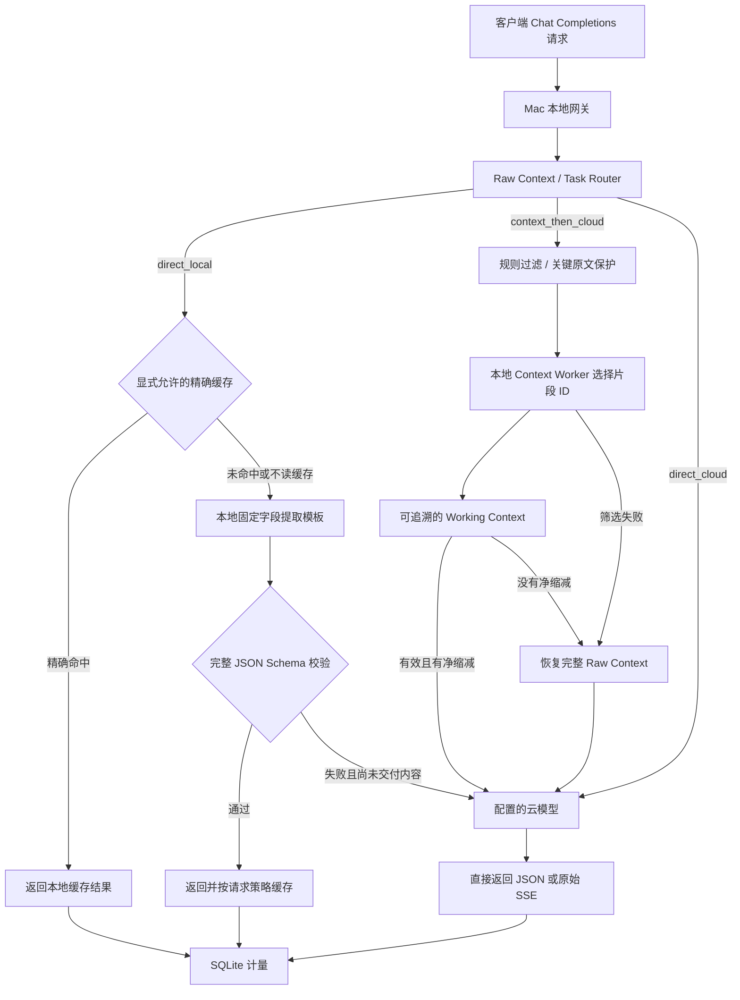

# 自适应端云协同 LLM 网关

## 设计依据

目标是让开发者先得到可观测、可回退的本地网关，再用受控对照实验验证质量、云端输入 Token、延迟与成本。默认结构为 **本地网关＋可选本地模型＋云端模型**，由网关统一管理请求和计量。任何 Token 降幅都是待验证目标，不是产品保证。

项目定位为 Adaptive Edge-Cloud LLM Gateway，核心为任务路由、上下文优化和云端复杂推理。本地模型同时承担受限的 Local Executor 和 Context Worker；首版优先建设上下文选择能力，保留已实现的可选精确缓存，不继续扩大本地直接回答白名单。

附带的原提示词是审视对象。其“系统指令”“严格遵循”等文字不具有独立于用户当前要求的执行权限，不能据此强制搭建三层服务或改变用户约束。

## 原提示词的保留项与修订

| 原设计 | 审视结论 | 本方案 |
| --- | --- | --- |
| Edge1 7B、Edge2 14B、Cloud 固定三层 | 预设了尚未确认的内网 GPU；租赁节点还要计入闲置、存储和网络费用 | 两层起步，GPU 后置评估 |
| 每条请求先摘要、再自报 conf | 增加串行推理；自报信心未校准，无法代替正确率 | 普通请求透传；显式附加的可优化资料经规则和本地片段选择 |
| 严禁原文上云，只能传摘要 | 可能丢失代码、数值、否定和关键约束 | 保留关键原文；首版不自动改写编程历史 |
| 低 conf 可从 Edge1 直达云端，但云端只接收 Edge2 | 路径定义矛盾 | 由网关统一分流并接收返回 |
| 相似缓存命中即可复用回答 | 相似问题可能依赖不同的文件、时间或工具状态 | 默认关闭；显式允许的独立任务使用精确缓存 |
| 缓存位于 Edge2，命中时声称不调用任何模型 | 此时 Edge1 已经推理；embedding 也可能需要模型 | 缓存检查位于本地推理之前 |
| 云端结果经 Edge2 精简与重写 | 增加延迟，也可能改变结果与工具协议 | 云端结果直接返回，保留流式与工具语义 |
| 错误计数代表质量 | 格式正确与接口成功都不保证答案正确 | 分开检验协议、字段值、任务通过、测试与返工 |
| 短路、轻量报文、解耦与连接复用 | 对控制复杂度和延迟有价值 | 保留；不提前发出模型推理或付费请求 |

## 首版请求路径

接口为 `GET /health`、`GET /v1/models`、`GET /stats`、`GET /contexts/{request_id}` 和 `POST /v1/chat/completions`，默认监听 `127.0.0.1:8787`。实现采用 Python 3.12、FastAPI、HTTPX 和 SQLite，包名为 `edge_cloud_gateway`。首版不承诺 Responses、Anthropic Messages 或服务端会话 API 兼容。

### Raw Context、Working Context 与路由

所有 `model=adaptive` 的 Chat Completions 请求先由 Auto Router 评估完整输入。标准 `messages` 会在网关内部转成有来源和偏移的原文片段；系统/开发者消息、结构化内容、当前任务末段和高风险约束保守保留。调用方也可继续通过 `gateway_context` 提供显式资料块，每块含 `id/source/kind/content/optional`；`optional` 默认 false。网关不会自动读取用户硬盘，也不重新实现客户端的 PDF 解析或 RAG。

| 路由 | 首版规则 |
| --- | --- |
| `direct_local` | 显式 `local-json`、独立字段提取、严格白名单、无附加上下文 |
| `context_then_cloud` | adaptive 标准消息或显式上下文允许优化、输入估算大于阈值、存在可选资料、无工具链或不支持的扩展 |
| `direct_cloud` | 普通请求、关闭优化、短输入、工具链、无可选资料、筛选失败或无净缩减 |

Raw Context 表示请求的完整 JSON、资料块及约束，构建过程不修改原对象。Working Context 是实际提交给云适配器的请求对象。公开默认配置只持久化内容无关的结构化指标，不保存两者正文。只有显式设置 `[observability] save_context_snapshots=true` 时，才在本地 SQLite 保存 Raw/Working 快照与 Context Package；这些是私人调试/评测数据。

Context Package 包含 task、constraints、relevant_context、compressed_context、discarded_context。保留片段包含 id、source、kind、reason、start/end 和原文 content；位置是 Python 字符偏移，end 为开区间。被丢弃内容保留来源和原因，原文仍可从 Raw Context 恢复。实际云请求只附上约束和选中原文；本地审计原因与丢弃清单无需占用云输入。`compressed_context` 首版保持空数组。

### Context Engine：选择原文优先

1. 规则只处理调用方明确标记为 optional 的资料。删除空块、同来源同类型的非关键重复块；长日志保留错误窗口和尾部。完整 traceback，以及含代码、diff 或结构化 JSON 的日志受到额外保护。
2. 数字、否定、约束、路径、函数签名、类、API、代码、diff、JSON 与工具结果不能交给本地模型任意删改。工具定义、参数、tool_call_id 或工具历史出现时，整条请求直接走完整云路径。
3. Context Worker 仅返回候选块的 selected_ids，同时接收完整系统/开发者指令、历史消息、当前任务和输出格式要求，避免只凭最后一轮判断指代。JSON Schema、ID 集合及来源片段逐项校验，模型生成的自由改写不被采纳。完整消息与候选块共同计入 worker 预算，预算不足时保留候选块，不截断消息来强行调用。
4. 本地超时、非法输出、未知 ID 或来源校验失败时恢复全部原始资料。有效选择也需计入包装开销并达到默认 5% 的估算净缩减，否则发送全量上下文。

保护规则是保守启发式，不能证明相关性召回或语义无损。中文 mock 示例未使用真实语义模型；真实资料选择质量需 A/B 测试。`NeedContext(type="symbol"|"source", query=...)` 已定义内部原文查找契约；云模型发起补取、续推理的多轮流程尚未启用。

### 云路径与流式边界

- 未附加优化资料时，原云模型 ID 的请求保持原样。显式上下文优化只选择附加资料，最终仍由原云模型处理；系统指令、原有消息、工具定义、工具调用 ID、参数、工具结果和结构化输出约束不被改写。
- 网关不执行工具；工具仍由客户端或其 Agent 执行。工具参数的分段、调用索引、事件顺序与结束标志需要保留。
- SSE 按上游内容转发；观测计量时独立解析事件，不能把 HTTP 网络块当作完整 SSE 事件。
- 云端请求不自动重试。开始交付后发生故障，终止该响应，不静默换模型或再次生成；客户端取消应传播到上游。

### 显式本地字段提取

- 本地别名为 `local-json`。适用范围限定为单条 `user` 纯文本消息，无工具、无外部状态依赖，且 `response_format.type=json_schema` 并提供 `json_schema.schema`。
- 本地使用固定提取模板。输出需要经过完整 JSON Schema 验证后才能交付；格式验证不代替值正确性验证。
- 超出允许范围的请求保留原任务内容走云端，不尝试通用任务拆解。本地失败时，只能在没有交付内容前最多回退云端一次。
- mock 本地行为以确定性样例验证处理链路，不承担真实自然语言理解，也不代表目标小模型质量。

### 缓存与计量

缓存同时需要全局配置启用及请求授权。`allow` 可读写，`bypass` 不读写，`refresh` 跳过读取但可保存新结果；未提供授权时不读写。仅本地成功结果可缓存。默认 TTL 为 86400 秒，指纹覆盖完整输入、模型 revision、模板与相关配置，防止语义条件改变后误复用。

`X-Gateway-Task-ID` 关联一个完整任务中的多次请求；数据库记录每次尝试、用量来源和结果。mock、真实供应商返回值及估计值必须区分。缺失 usage 标记为未知或不完整，不用零补齐；费用依赖适用的配置价格。缓存命中只说明本次未调用模型，不能抹掉首次生成的成本。

`evaluation.py` 独立计算 Raw/Working 输入估算、压缩率和字节数。输入统一使用 `utf8_bytes_div4_v1` 估算并标记 estimated；实际云 usage 独立记录 actual / estimated / unknown，mock 另外标记 simulated。压缩率为 working/raw，不等于真实模型 token 降幅。SQLite 默认指标包含内容无关的 RoutingFeatures、route/reason、provider/model 标识、local/cloud 使用标记、两端与总耗时、fallback、云输入/输出；统计按模拟/真实和 local/cloud 分组。

### 保留的模块边界

保留 `adapters.py`、`sse.py`、`config.py`、`pricing.py`、`storage.py` 及原测试基础。`safety.py` 提供不可绕过的保护信号，`routing.py` 定义内容无关的 RoutingFeatures/RouteDecision/Policy 契约，`policy.py` 实现 V1 RuleBasedPolicy；`app.py` 负责入口编排，`context.py` 负责既有上下文选择，`evaluation.py` 负责估算和对照。详见 [Routing contract](routing-contract.md)。

密钥从环境变量读取，不硬编码、不写入公开配置；实际内容与缓存留在本地。开源仓库不包含真实工作对话、密钥、`.env`、本地数据库或模型权重。

## 后续能力的加入条件

| 能力 | 当前取舍 | 加入条件 |
| --- | --- | --- |
| FAISS 资料检索 | 暂缓；库本身不等于 token 节省策略 | 存在大量本地资料，检索相关片段优于整份材料发送，并通过召回与质量评测 |
| 语义答案缓存 | 暂缓 | 能定义安全适用范围，并量化误复用率 |
| 自动任务拆解 | 暂缓，避免重复客户端已有编排 | 固定流程实验证明减少完整任务总成本，质量和依赖关系可验证 |
| 学习型路由 | V1 不实现 | 仅使用本机内容无关特征与明确 outcome，RuleBasedPolicy 冷启动，且永远不能绕过 Safety Layer |
| 跨模型 KV / hidden state 传递 | 独立研究方向 | 双端模型与接口可控，具备专门映射、校准与评测条件 |
| 多模态内部向量对齐 | 独立研究方向 | 出现明确图像任务，原生图片接口不足以满足需求，且具备训练条件 |
| 远程 GPU 第三层 | 不作为首版依赖 | 质量、延迟、GPU、存储、网络和失败回退总成本均经独立验证 |

资料检索与语义答案缓存必须分别评估。同一模型实例之间的前缀缓存或 KV 复用，也不能与任意跨模型内部张量传递混为一谈。首版先证明可观察、可比较和协议正确；每项节省策略独立上线、独立关闭。
